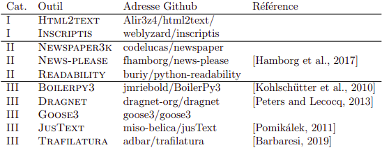
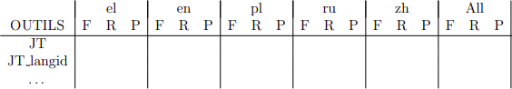

# Web Scrapping - Fouille de textes & Scrapping

**ANTELME Mathis**

## Consignes

Récupérez les données pour ce TD sur Moodle (`Corpus detourage.zip`). Ce jeu de données est composé de documents **HTML** bruts et de la version nettoyée de référence (reference) où le code source a disparu pour ne laisser que le texte et les marques de paragraphes. Vous alimenterez au fur et à mesure du TD un fichier log (txt) où vous noterez tous vos résultats Vous rendrez le code utilisé à chaque étape (nommez le de façon explicite et/ou ayez recours à un **README**) ainsi que votre log avec les différents résultats et tableaux.

## Utilisation du programme

Afin de facilement utiliser ce programme (à des fins de correction), il vous faudrat fournir les données à traiter (ici le corpus **HTML** et le corpus de référence) dans un dossier nommé `data/Corpus_detourage` à la racine du projet sous la forme de deux sous-corpus nommé `html` et `reference`.

Il faudrat aussi créer un dossier `out` qui contiendrat toutes les statistiques générées si ce dossier n'est pas présent (encore une fois à la racine du projet).


Le programme principal est situé dans le fichier `main.py` (duh) qui peut être lancé avec des arguments. On peut lancer le code de chaque exercice individuellement avec le numéro de l'exercice en argument, tout les exercices avec l'argument `all` et supprimer tout les fichiers généré avec l'argument `clean` (par défaut le programme n'execute rien).

> **Note:** Par défaut le code utilise **TOUT** les outils pour l'extraction de données ce qui peut prendre un certains temps (environ 1h30). Le programme est suffisamment intelligent pour ne pas extraire de données si le fichier de sortie existe déjà, attention si vous changez des dossiers de place;

### Exemple d'utilisation

**Exécution de l'exercice 1:**

```bash
python main.py 1
```

**Exécution de tout les exercices:**

```bash
python main.py all
```

**Nettoyage des fichiers générés:**

```bash
python main.py clean
```

<!-- TODO: ajout de la fonction de nettoyage -->

## Exercice 1 - Utilisation d'outils de détourage

Le détourage, ou extraction de texte à partir de données Web, consiste à extraire du code source **HTML** les données utiles, ici le texte. C'est une sous-tâche de la tâche du *scrapping*.

Vous allez utiliser au moins trois des outils mentionnés durant le CM, avec à *minima* **jusText** et un outil pour chaque catégorie (cf: tableau ci dessous).



Avec chacun des de ces outils vous allez extraire le contenu textuel des fichiers html bruts et le stocker dans des dossiers séparés (portant le nom de l’outil tel qu’indiqué dans le tableau 1). Veillez à ce que les marques de paragraphes soient préservées (en effet elles sont présentes dans la référence). Ajoutez au besoin des balises `<p>` au début et à la fin de chaque ligne dans le fichier généré.

Compilez pour chacun de ces outils ainsi que pour la référence (le dossier `reference`) quelques statistiques rapides sur les fichiers générés:

- Taille totale des données en nombre de lignes, moyenne et écart-type;
- Taille totale des données en nombre de caractères, moyenne et écart-type des différences par fichier;
  - Pour le dossier `reference`;
  - Puis le dossier utilisé pour chaque outil;

Repérez les fichiers pour lesquels l’écart avec la référence est particulièrement grand: fichier nettement plus grand (*bruit*) ou plus petit (*silence*). Calculez pour chaque outil la moyenne et l’écart-type de la différence de taille en caractères par rapport au fichier de référence.

---

Pour ce premier exercice on va utiliser les *wrappers* fournis sur Moodle qui vont nous permettre de traiter ces fichiers en utilisant les différents outils. On va donc développer un programme qui va parcourir un dossier afin d'en récupérer les différents fichiers sources afin d'en extraire le contenu textuel, contenu que l'on va ensuite écrire dans un autre fichier.

Chaque outil va posséder un dossier de sortie qui lui sera attitré afin de stocker un corpus par outils, ce qui facilitera les comparaisons.


Pour effectuer les actions décrites ci-dessus, on va principalement appeller la fonction `create_subcorpus()` (dans le fichier `main.py`) qui prend en paramètre un chemin d'accès vers un corpus, un outil à utiliser et le mode de fonctionnement de l'outil.

```python
def create_subcorpus(corpus_path, tool_mode="default", tool="BP3"):

    logging.info("Scanning folder at: {} using {} tool".format(corpus_path, tool))

    # on récupère la liste des fichiers présents dans le corpus
    html_corpus = glob.glob(corpus_path + "/*")

    # on créé un dossier qui va permettre de stocker les résultats par outil
    sub_corpus_path = "./data/" + tool + "_" + tool_mode + "/raw"
    logging.info("Creating output folder at: {}".format(sub_corpus_path))
    makedirs(sub_corpus_path)

    # pour chaque fichier dans le corpus
    for file_path in html_corpus:
        
        # on construit un nom de fichier utilisé lors de l'écriture
        file_name = file_path.split("/")[
            -1
        ]
        output_file_path = sub_corpus_path + "/clean_" + file_name + ".txt"

        # si le fichier de sortie existe déjà on passe au suivant
        if path.exists(output_file_path):
            logging.warn("File {} already exists, skipping".format(output_file_path))
        
        # sinon on extrait le contenu textuel du fichier
        else:

            logging.info("Processing file: {}".format(file_path))

            # le contenu html du fichier actuel
            html_file_content = open_file(
                file_path
            )

            # on récupère la liste des paragraphes
            text_paragraphs = apply_tool(
                tool, html_file_content, mode=tool_mode
            )

            # la variable qui sert à stocker le contenu textuel final du fichier actuel
            text_file_content = ""

            # pour chaque paragraphe du contenu extrait (on ajoute des balises de paragraphes)
            for paragraph in text_paragraphs:
                text_file_content += "<p>" + paragraph + "</p>\n"

            # on inscrit notre résultats dans un fichier
            with open(output_file_path, mode="w", encoding="utf-8") as output_file:
                output_file.write(text_file_content)
                output_file.close()

            logging.info(
                "Wrote {} lines into {}".format(
                    len(text_file_content), output_file_path
                )
            )
```

---

Une fois le contenu extrait du **HTML** on va pouvoir calculer des statistiques sur nos corpus. Pour cela on va utiliser le script `stats_corpus.py` qui va nous permettre de génerer les différentes statistiques.

```python
def main():

    # génération des stats pour le corpus de référence
    print(
        "{}; {}, {}".format(
            './data/Corpus_detourage/html',
            get_line_stats('./data/Corpus_detourage/html'),
            get_character_stats('./data/Corpus_detourage/html'),
        )
    )

    # on récupère les différents outils disponibles
    f = open("./src/tool_detourage/tool_modes.json")
    tools = json.load(f)
    f.close()

    # on affiche toutes les statistiques pour les corpus généré par des outils
    for key in tools.items():
        tool_corpus_path = PATH_TO_CORPUS + "/" + tools[key] + "_default/raw"
        print(
            "{}; {}, {}".format(
                tool_corpus_path,
                get_line_stats(tool_corpus_path),
                get_character_stats(tool_corpus_path),
            )
        )
```

On obtient les résultats [suivants](./out/exercice1_stats.csv).

> **Note:** Dans un soucis de correction, le programme `main.py` peut recevoir en argument le numéro de l'exercice afin d'éviter de faire tourner tout le code à chaque fois. Si l'on souhaite lancer l'exercice 1 par example on va utiliser la commande suivante: `python main.py 1` (plus de détails dans la partie utilisation en début de document);

## Exercice 2 - Guider le scrapping avec la reconnaissance de langue

**Justext** utilise une heuristique qu’il adapte en fonction de la langue supposée du document. Quand on ne lui fournit pas la langue, il utilise son modèle par défaut ”indépendant de la langue”. Nous allons voir si nous pouvons améliorer les résultats grâce à l’integration d’un module d’identification de la langue.

Vous stockerez les résultats de cette étape dans un dossier `./data/JT_deault/langid`:

- Utilisez le module [langid.py](https://github.com/saffsd/langid.py);
- Pour chaque fichier déjà traité avec **Justext**:
  - Identifiez la langue (à partir du fichier nettoyé par **Justext** ou avec le **HTML** original);
  - Utilisez l'information sur la langue our lancer **Justext** avec le modèle de langue correspondant;
  - Stockez les fichiers ainsi obtenus dans le dossier `./data/JT_deault/langid`;

> **Note:** langid utilise les codes de langue *ISO 639-11* alors que **Justext** utilise les noms de langues en toutes lettres : *Greek (el)*, *English (en)*, *Polish (pl)*, *Russian (ru)*, *Chinese (zh)*;

Refaites la même opération en utilisant la vraie information sur la langue de chaque document qui figure sur Moodle (`doc_lg.json`). Stockez les résultats dans un dossier `./data/JT_default/trueLANG`.

Recalculez les statistiques de la fin de l’exercice précédent pour chacun des 5 dossiers, stockez les dans un tableau.

---

Pour la réalisation de cette étape on va réutiliser les wrappers fournit sur **Moodle**. Ces derniers utilisent déjà la détection de la langue par défaut pour **Justext**, on va donc modifier le comportement de `get_paragraphs_JT()` la fonction qui permet d'extraire le contenu textuel avec **Justext**. On va tout simplement lui ajouter un nouveau mode de fonctionnement qui va détecter la langue et le mode par défaut sera indépendant de langue. Etant donné qu'aucune *stopList* n'est fournie pour la langue Chinoise, on utilisera aussi le mode idépendant si cette langue est détectée.

En prévision de la deuxième partie de l'exercice on va définir un autre mode qui va permettre d'utiliser la *vraie* langue du contenu qui est stockée dans le fichier `doc_lg.json` afin de fournir les codes de langue à **Justext** que l'on appellera `lang_specified`.

> **Note:** Afin de pouvoir sélectionner la langue dans le fichier **json** qui fournit la langue de chaque fichier, on l'ouvrira à chaque fois que l'on analysera un fichier. Pour cela on fournit le nom de fichier dans l'appel de la fonction (on aurai aussi pu directement fournir un dictionnaire en paramètres qui contient les fichier et leur langue respectives, cela aurait pu éviter d'ouvrir notre fichier **json** à chaque analyse).

```python
def get_paragraphs_JT(str_text, mode, file_name=''):
    """
    using Justext
    """
    if mode == "_english":
        stop = justext.get_stoplist("English")
    elif mode == 'lang_detect':
        lang = get_langid(str_text)
        if lang == "Chinese":
            stop = set()
        else:
            stop = justext.get_stoplist(lang)
    # mode ou on détecte la 'vraie' langue fournie par le fichier doc_lg.json 
    elif mode == 'lang_specified' and file_name != '':
        with open(DOC_LG_PATH, mode='r', encoding='utf-8', errors='ignore') as lang_code_file:
            json_data = json.load(lang_code_file) # on charge nos codes de langue
            lang = json_data[file_name] # on récupère la langue
            if lang == "Chinese":
                stop = set()
            else:
                stop = justext.get_stoplist(lang)
    else:
        stop = frozenset()
    
    if len(stop) == 0:
        any_lang_stop_words = get_all_stop_words()
        paragraphs = justext.justext(str_text, any_lang_stop_words)
    else:
        paragraphs = justext.justext(str_text, stop)
    list_paragraphs = [x.text for x in paragraphs if not x.is_boilerplate]
    return list_paragraphs
```

> **Note:** La variable `DOC_LG_PATH` est déclarée au début du fichier `detourage.py`;

Ensuite il ne reste plus qu'a extraire le contenu textuel en utilisant **Justext** en mode détection de langue (*lang_detect*) et par défaut (*default*).

Etant donné que la génération de statistique semble être utilisée de nombreuse fois, plutôt que de l'effectuer dans un fichier différent de manière plus ou moins propre, on va utiliser les fonctions définies précédement afin d'en créer une nouvelle dans `main.py` qui va nous permettre d'effectuer des statistiques sur tout les sous-corpus d'un dossier et de stocker ces résultats dans un fichier csv.

```python
def generate_corpus_stats(path_to_corpus, output_file_path):
    """
    Effectue les statistiques sur les sous-corpus créés et les stockes dans un fichier désigné
    """
    corpus_stats = dict() # le dictionnaire qui contient nos statistiques ([corpus_name]: (line_stats, char_stats))

    file_list = glob.glob(PATH_TO_CORPUS + '/*') # on récupère la liste des fichiers dans le corpus de données
    for file_path in file_list:
        # on vérifie si le fichier actuel est un dossier (donc un sous-corpus)
        if path.isdir(file_path):
            logging.info('Found corpus at: {}'.format(file_path))

            # on créé un nom de corpus
            tool_corpus_path = file_path + "/raw"
            # on stocke nos statistiques dans un dictionnaire
            corpus_stats[tool_corpus_path] = (get_line_stats(tool_corpus_path), get_character_stats(tool_corpus_path)) 

    # on stocke nos stats
    with open(output_file_path + '_stats.csv', mode='w', encoding='utf-8', errors='ignore') as output_file:
        
        # on écrit nos entetes afin de faciliter la lecture du fichier
        output_file.write('corpus_name, line_count, line_average, line_deviation, char_count, char_average, char_deviation\n')

        for key in corpus_stats:
            output_string = key.split('/')[2]

            for index in range(len(corpus_stats[key])):
                for value in corpus_stats[key][index].values():
                    output_string += (', ' + str(value))

            output_file.write(output_string + '\n')

        logging.info('Stats for {} were written to {}'.format(path_to_corpus, output_file_path))

        output_file.close()
```

On obtient donc les résultats [suivants](./out/exercice2_stats.csv):

> **Note:** Dans un soucis de correction, le programme `main.py` peut recevoir en argument le numéro de l'exercice afin d'éviter de faire tourner tout le code à chaque fois. Si l'on souhaite lancer l'exercice 2 par example on va utiliser la commande suivante: `python main.py 2` (plus de détails dans la partie utilisation en début de document);

## Exercice 3 - Evaluation Intrinsèque

Même si l’écart de taille avec le fichier référence nous donne une idée de la qualité du résultat, ce n’est pas suffisant. Récupérez les deux fichiers `cleaneval_tool.py` et `test_eval.py` sur **Moodle**.

Le premier contient une librairie pour évaluer la correspondance entre le fichier nettoyé et le fichier de référence (par le biais d’une distance d’édition). Le script a été dévelopé pour la campagne d’évaluation *Cleaneval*.

Pour chaque outil vous calculerez la moyenne des *F-mesure* (`F`), *Rappel* (`R`) et *Précision* (`P`) par langue ainsi que pour l’ensemble des langues.




Ajoutez maintenant le détail par source et faites une moyenne par source (considérez le nom du site web uniquement) puis par source et par langue. Utiliser une moyenne non pondérée par le nombre de documents permet de mieux apprécier la qualité de la couverture de chaque outil.

---

Pour la réalisation d'un tel tableau on pourrai utiliser `langid` afin de détecter la langue, 

20111101_www.express.gr_6648058818bdb924afb68d540f362451eec0e42a8d47455b17b6ca3e

