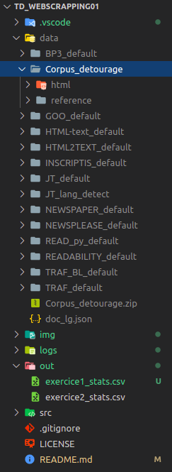

# Web Scrapping - Fouille de textes & Scrapping

**ANTELME Mathis**

## Consignes

Récupérez les données pour ce TD sur Moodle (`Corpus detourage.zip`). Ce jeu de données est composé de documents **HTML** bruts et de la version nettoyée de référence (reference) où le code source a disparu pour ne laisser que le texte et les marques de paragraphes. Vous alimenterez au fur et à mesure du TD un fichier log (txt) où vous noterez tous vos résultats Vous rendrez le code utilisé à chaque étape (nommez le de façon explicite et/ou ayez recours à un **README**) ainsi que votre log avec les différents résultats et tableaux.

## Exercice 1 - Utilisation d'outils de détourage

Le détourage, ou extraction de texte à partir de données Web, consiste à extraire du code source **HTML** les données utiles, ici le texte. C'est une sous-tâche de la tâche du *scrapping*.

Vous allez utiliser au moins trois des outils mentionnés durant le CM, avec à *minima* **jusText** et un outil pour chaque catégorie (cf: tableau ci dessous).

<!-- TODO: ajout tableau des outils -->

Avec chacun des de ces outils vous allez extraire le contenu textuel des fichiers html bruts et le stocker dans des dossiers séparés (portant le nom de l’outil tel qu’indiqué dans le tableau 1). Veillez à ce que les marques de paragraphes soient préservées (en effet elles sont présentes dans la référence). Ajoutez au besoin des balises `<p>` au début et à la fin de chaque ligne dans le fichier généré.

Compilez pour chacun de ces outils ainsi que pour la référence (le dossier `reference`) quelques statistiques rapides sur les fichiers générés:

- Taille totale des données en nombre de lignes, moyenne et écart-type;
- Taille totale des données en nombre de caractères, moyenne et écart-type des différences par fichier;
  - Pour le dossier `reference`;
  - Puis le dossier utilisé pour chaque outil;

Repérez les fichiers pour lesquels l’écart avec la référence est particulièrement grand: fichier nettement plus grand (*bruit*) ou plus petit (*silence*). Calculez pour chaque outil la moyenne et l’écart-type de la différence de taille en caractères par rapport au fichier de référence.

---

Pour la réalisation de cet exercice nous allons utiliser trois outils, à savoir, **jusText**, **inscriptis** et **python-readability** qui vont nous permettre d'extraire le contenu textuel de pages web. Ces trois outils peuvent être facilement installés en utilisant **pip** et les commandes suivantes:

```bash
pip install justext
pip install inscriptis
pip install readability-lxml 
```

On va ensuite créer un dossier pour chacun de ces outils dans le dossier `data`. On va donc obtenir une arborescence de fichier comme suit:

<!-- TODO: changer la photo -->
 

Ensuite il ne nous reste plus qu'à définir nos scripts qui vont utiliser ces outils. De manière générique, on va parcourir les fichiers présents dans le dossier `data/Corpus_detourage/html`, les lires un par un, en extraire les données textuelles puis les stocker dans un fichier `.txt` associé.

Les scripts qui sont responsable de cela sont les suivants: `jusText.py`, `Inscriptis.py` et `Readability.py`. 

Voici un example avec jusText:

> jusText.py
```python
import justext
import glob
import os.path
import logging

CORPUS_PATH = './data/Corpus_detourage/html'
RESULTS_PATH = './data/justext/raw'
file_path_list = glob.glob(CORPUS_PATH + '/*') # on récupère la liste des fichiers de notre corpus

# on définit un logger
logging.basicConfig(filename='./logs/exo1_justext.log', level=logging.INFO)

# on récupère tout les stopwords
def get_all_stop_words():
  stop_words = set()
  for language in justext.get_stoplists():
      stop_words.update(justext.get_stoplist(language))
  return stop_words

for file_name in file_path_list:
    file_html = open(file_name, 'r', encoding='utf-8', errors='ignore') # on ouvre le fichier pour le lire
    file_content_html = file_html.read() # on récupère le contenu HTML de la page

    # on récupère les paragraphes
    file_paragraphs = justext.justext(str(file_content_html), get_all_stop_words())
    
    logging.info("=== Reading file {} ===".format(file_name))

    # on ouvre un fichier d'écriture pour stocker les informations lues
    output_file_name = RESULTS_PATH + '/' + file_name.split('/')[4] + '_clean.txt'

    # si le fichier existe déjà on ne le réécrit pas et on passe au suivant
    if os.path.exists(output_file_name):
        logging.info('[Info] - File {} already exsits, skipping;'.format(output_file_name)) # si le fichier existe déjà alors on passe au suivant
    
    # si il n'existe pas alors on le créé
    else:
        with (open(output_file_name, 'w', encoding='utf-8')) as output_file:
            file_content_txt = '' # le contenu textuel de la page

            for paragraph in file_paragraphs:
                # si le paragraphe actuel n'est pas une boilerplate alors on l'ajoute dans notre string de contenu textuel (un paragraphe par ligne)
                if not paragraph.is_boilerplate:
                    file_content_txt += '<p>' + paragraph.text.replace("\n", '') + '</p>\n'

            logging.info('Writing {} lines to -> {}'.format(len(file_content_txt), output_file_name))
            
            # on écrit notre contenu dans notre fichier et on le ferme
            output_file.write(file_content_txt)
            output_file.close()
```

Si on cherche désormais à effectuer des statistiques sur les deux nouveaux corpus, on va utiliser le script `stats_corpus.py` qui permet d'effectuer ces statistiques.

```python
import glob

def get_char_file(file_path):
    file = open(file_path, 'r', encoding='utf-8', errors='ignore')
    res = 0
    for line in file.readlines():
        res += len(line)

    return res

def get_char_total(path_to_folder):
    res = 0
    file_path_list = glob.glob(path_to_folder + '/*')
    for file_path in file_path_list:
        res += get_char_file(file_path)

    return res

def get_char_average(path_to_folder):
    res = list()
    file_path_list = glob.glob(path_to_folder + '/*')
    for file_path in file_path_list:
        res.append(get_char_file(file_path))

    return round(sum(res)/len(res), 2)

def get_stats_for_corp(corpus_path, corpus_name):
    print("{} corpus stats:".format(corpus_name))
    print("total chars in corpus: {}".format(get_char_total(corpus_path)))
    print("average char count in corpus: {}\n".format(get_char_average(corpus_path)))

get_stats_for_corp('./data/justext/raw', 'justext')
get_stats_for_corp('./data/Corpus_detourage/reference', 'reference')
```

Grâce à ce script on peut comparer deux corpus sur leur nombre de caractères et leur moyenne.

> **Note:** les fonctionnalités ne sont pas toutes mises en place (écart-type manquant, un seul outil utilisé pour le moment) du fait de la contrainte de temps;

## Exercice 2 - Guider le scrapping de la reconnaissance de la langue

Justext utilise une heuristique qu’il adapte en fonction de la langue supposée du document. Quand on ne lui fournit pas la langue, il utilise son modèle par défaut ”indépendant de la langue”. Nous allons voir si nous pouvons améliorer les résultats grâce à l’integration d’un module d’identification de la langue. Vous stockerez les résultats de cette étape dans un dossier JT langid 

- Utilisez le module langid.py (https://pypi.org/project/langid/) 
- Pour chaque fichier déjà traité avec JT : 
  - Identifiez la langue (à partir du fichier nettoyé figurant dans le dossier JT s’il n’est pas vide sinon avec le Html original) 
  - Utilisez l’information sur la langue pour lancer JT avec le modèle de langue correspondant. NB: langid utilise les codes de langue ISO 639-11 alors que JT utilise les noms de langues en toutes lettres : Greek (el), English (en), Polish (pl), Russian (ru), Chinese (zh) 
  - Stockez le fichier ainsi nettoyé dans JT langid 

Refaites la même opération en utilisant la vraie information sur la langue de chaque document qui figure sur Moodle (doc lg.json). Stockez les résultats dans un dossier JT trueLg. Recalculez les statistiques de la fin de l’exercice précédent pour chacun des 5 dossiers, stockez les dans un tableau.